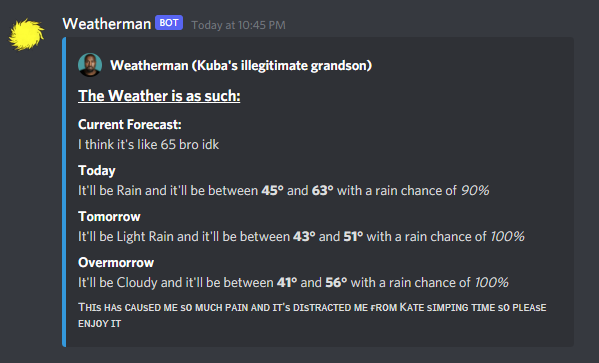

# Weatherman

A utility bot for my personal discord server.

This uses the [python-weather](https://github.com/vierofernando/python-weather) api by vierofernando

## *commands*

`??weather`: gets the weather

Here's what the output looks like:



`??whatdoido`: tells you what to do if you can't decide

`??poll <question>`: asks the question and adds the 👍 and 👎 (thumbs up and thumbs down) emojis to it.

---

If want to use this, put a file called `TOKEN` in `data/` in the same folder as your bot.
It should contain the token for the bot you're running.

```
|
|- bot.py
|
|- data\
|---- TOKEN
```